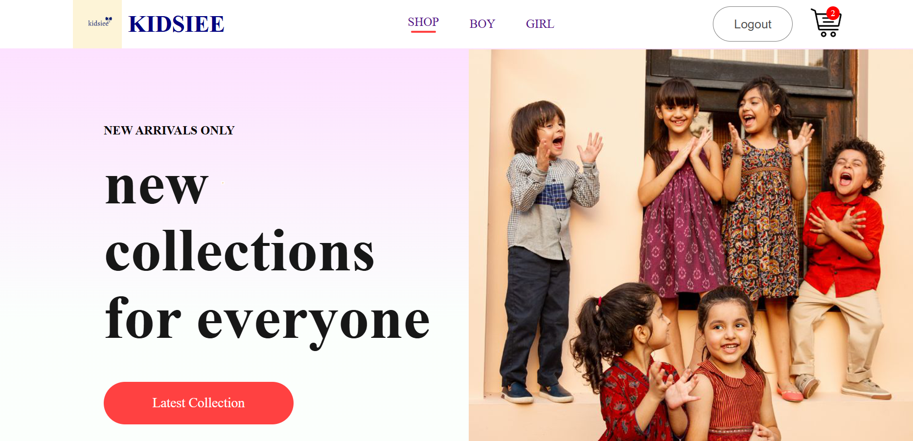
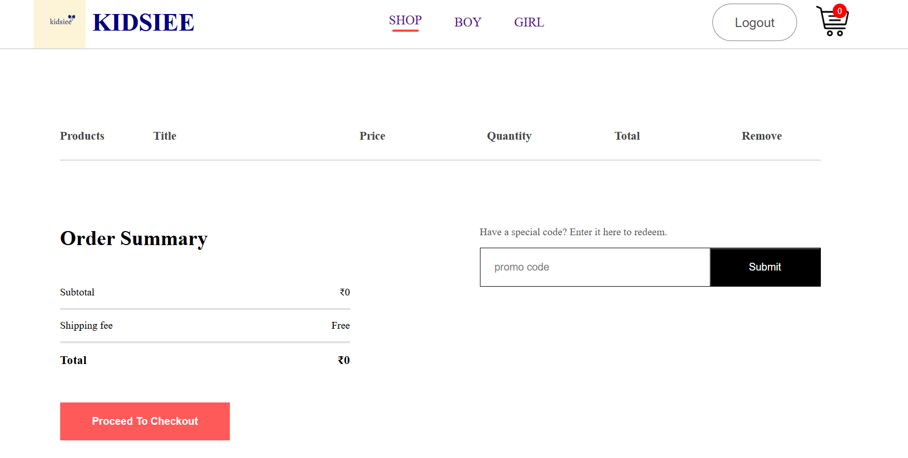
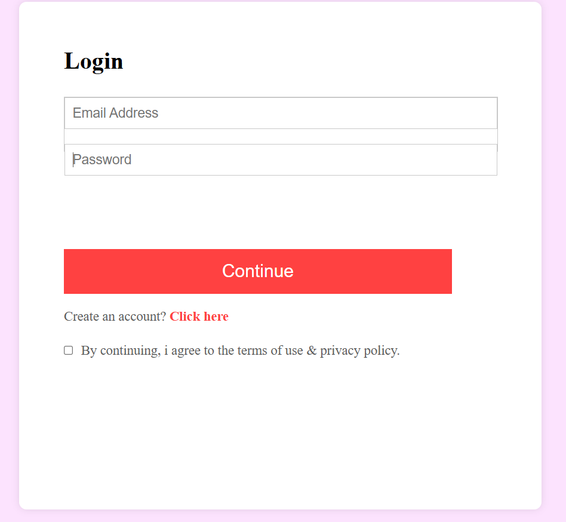
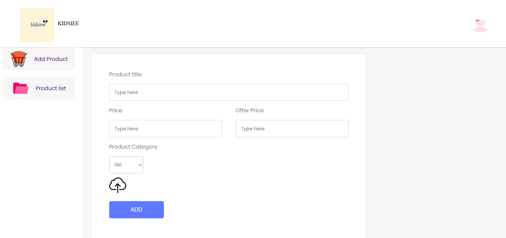

# Kidsiee – E-commerce Website for Kids

**Kidsiee** is a full-stack e-commerce platform designed specifically for kids’ clothing and accessories. Built using the **MERN stack**, it features separate interfaces for customers and admins. The project supports browsing, cart management, product uploads, and more — offering a playful, smooth user experience.

---

## Features

### Customer Side (Frontend)
- View boys’ and girls’ categories
- Add to cart & checkout flow
- Product pages with pricing & details
- User login & signup with JWT
- Mobile-friendly responsive design

### Admin Panel
- Add new products (with image upload)
- Remove/update products
- View all product listings
- Secure access with dedicated admin dashboard

---

## Tech Stack

| Layer         | Tech Used            |
|---------------|----------------------|
| **Frontend**  | React.js, Vite, CSS  |
| **Backend**   | Node.js, Express.js  |
| **Database**  | MongoDB (Mongoose)   |
| **Auth**      | JWT (JSON Web Tokens)|
| **File Upload** | Multer for images |

---

## How to Run the Project Locally

### Backend

```bash
cd backend
npm install
node index.js
```
### Frontend
```bash
cd frontend
npm install
npm run dev
```
### Admin Panel
```bash
cd admin
npm install
npm run dev
```

---


## Screenshots

### Homepage


### Cart Page


### Login Page


### Admin Panel



